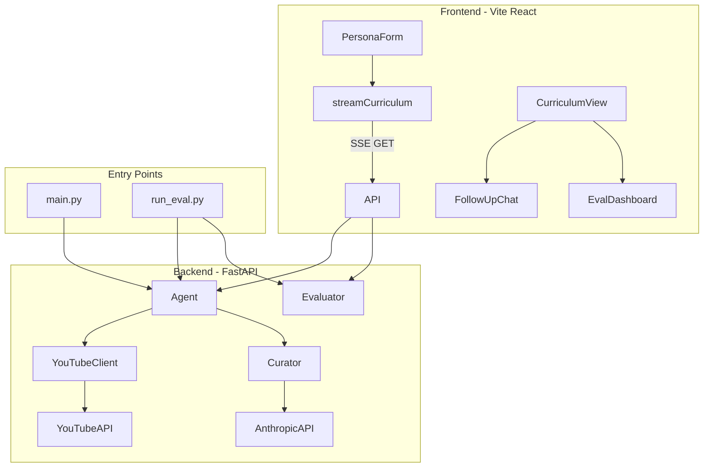
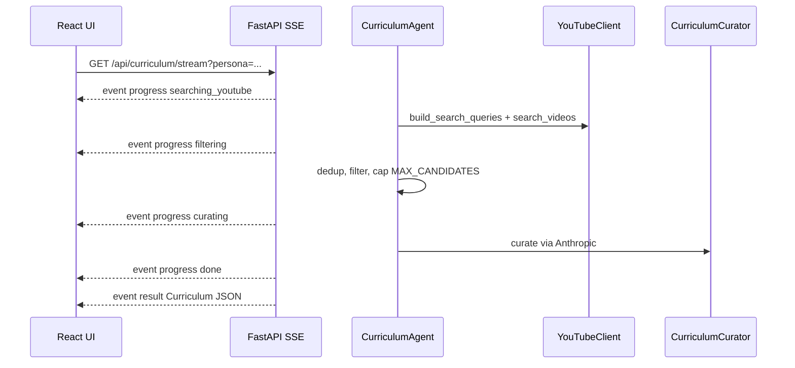

# Curriculum Builder — Implementation Plan

## Current State

The workspace at `d:\assesments-ai\rapidCanvas` is **empty**. Files are created at the **workspace root** using the exact paths from the spec (`backend/`, `frontend/`, `test_set/`, etc.) — not nested inside an extra `curriculum_builder/` folder. Canonical backend start: **`cd backend && uvicorn api:app --reload --port 8000`**.

## Gap Analysis (reviewed and fixed)

| # | Gap | Fix in plan |
|---|-----|-------------|
| 1 | `agent.run()` was planned as `async` but spec defines a **sync** `def run()` | Revert to sync `run()`; SSE bridge uses `asyncio.Queue` + `run_in_executor` |
| 2 | `.env` and `test_set/` paths break when uvicorn cwd is `backend/` | `config.py` defines `ROOT_DIR = Path(__file__).parent.parent` and resolves `.env`, `test_set/` from there |
| 3 | Missing `frontend/src/main.jsx`, full `vite.config.js` (React plugin), `index.html` root mount | Added to Phase 1 scaffold with explicit file contents |
| 4 | Rule 2 ("Anthropic only in curator.py") conflicted with evaluator LLM calls | Evaluator calls `curator.call_anthropic(prompt)` — single `messages.create` site |
| 5 | `VideoCandidate.url` construction not specified | Build as `https://www.youtube.com/watch?v={video_id}` in `youtube_client.py` |
| 6 | YouTube `videos().list` 50-ID limit across multi-query search | Dedup IDs before detail fetch; batch in chunks of 50 if ever exceeded |
| 7 | SSE persona query param needs URL encoding for JSON | Frontend `encodeURIComponent(JSON.stringify(persona))`; backend `urllib.parse.unquote` |
| 8 | `GET /api/test-personas` response shape undefined | Return `[{filename, persona_id, persona}]` for dropdown binding |
| 9 | `eval_results/eval_report.json` schema undefined | Defined below in Phase 7 |
| 10 | `run_eval.py` missing `sys.path` bootstrap | Same `sys.path.insert` pattern as `main.py` |
| 11 | No startup validation for missing API keys | Fail fast with clear HTTP 503 / CLI error message |
| 12 | No handling for 0 candidates after filtering | Agent raises descriptive error before LLM call; SSE emits `error` event |
| 13 | LLM may return unknown `video_id` | Curator skips invalid IDs with warning log; requires ≥1 valid entry or raises |
| 14 | `AgentProgressEvent.data` payload unused | Agent emits counts in `data` (e.g. `{"candidates": 23, "queries": 3}`) |
| 15 | Frontend UI state machine underspecified | Right panel: loading → `AgentProgress` → `CurriculumView`; `EvalDashboard` only after button click; reset `evalResult` on new run |
| 16 | `AgentProgress.jsx` step label mapping missing | Map backend steps (`searching_youtube`, `filtering`, `curating`, `done`) to display labels |
| 17 | `logging` for JSON parse retry not specified | `logging` module configured in `config.py`; curator logs raw LLM response on failure |
| 18 | Anthropic response parsing not specified | Safe access: `response.content[0].text` with type guard / fallback comment |
| 19 | `.gitignore` not in scaffold | Add `.env`, `venv/`, `node_modules/`, `__pycache__/`, `dist/` |
| 20 | `eval_notes` blind spots must match spec verbatim | Exact strings embedded in evaluator (note: second blind spot documents agent pre-filter limitation, not eval LLM logic) |
| 21 | `POST /api/*` routes need explicit executor wrapping | All agent/curator/evaluator blocking work wrapped in `run_in_executor` |
| 22 | CLI `--output` may target non-existent directory | `os.makedirs(dirname, exist_ok=True)` before write |
| 23 | `coverage_score` division by zero if `unknown` is empty | Return 1.0 when `len(unknown)==0` |
| 24 | `known_topic_avoidance` when 0 entries | Return 0.0 (no entries to evaluate) |
| 25 | No Cursor rules file for persistent enforcement | Create `.cursor/rules/curriculum-builder.mdc` with `alwaysApply: true` |
| 26 | Token logging only via logging module | `call_anthropic` must also `print()` input/output tokens to stdout per Cursor rules |
| 27 | Backend `print()` forbidden except token stdout | Use `logging` everywhere else; CLI uses Rich only |
| 28 | Frontend may batch SSE progress events | Append each event immediately in `onProgress` — `setProgressEvents(prev => [...prev, event])` |
| 29 | Components might call fetch directly | Enforce: only `client.js` imports fetch; components import from `api/client.js` |
| 30 | Blind spots only in eval_notes string | Also add `# BLIND SPOT:` comments inline in `evaluator.py` |
| 31 | Git submission requirements missing | Final commit tagged `v1-submission`; `eval_results/*.json` gitignored |

## Cursor Rules (enforcement)

Persist user-provided rules as [`.cursor/rules/curriculum-builder.mdc`](.cursor/rules/curriculum-builder.mdc) with `alwaysApply: true` during Phase 1 scaffold. Summary of binding constraints:

**Architecture boundaries — never cross:**
- Prompts → `backend/prompts.py` only
- Anthropic API → `backend/curator.py` only (`call_anthropic`)
- YouTube API → `backend/youtube_client.py` only
- Pydantic models → `backend/models.py` only
- Config/constants → `backend/config.py` via env only
- Frontend HTTP → `frontend/src/api/client.js` only (no fetch in components)

**Backend:** `run_in_executor` for all SDK calls; SSE sends `progress` → `result` or `error`; CORS from config; `{"error": message}` on exceptions.

**LLM:** Log `input_tokens`/`output_tokens` to **stdout** after every Anthropic call; strip fences before `json.loads`; one retry max on parse failure with ERROR log of raw response; never Anthropic outside `curator.py`.

**YouTube:** Real API data only; always second `videos().list` for duration/stats; `isodate` only for durations; explicit quota `RuntimeError`.

**Frontend:** Tailwind CDN only; pure SVG radar; backend-unreachable error state; `AgentProgress` updates **live per SSE event** (no batching).

**Code quality:** Python type hints + docstrings on every function/module; no bare `print()` in backend (exception: token stdout in `call_anthropic`); explicit React state — `useState(null)`, `useState([])`, `useState("")`, never untyped.

**Evaluation:** Programmatic metrics (budget, coverage, dedup) = zero LLM calls; LLM metrics use `build_eval_metric_prompt` from `prompts.py`; blind spots as `# BLIND SPOT:` comments in `evaluator.py` plus verbatim strings in `eval_notes`.

**Security:** No `.env` commit; no API keys in logs or frontend.

**Git:** Tag final commit `v1-submission`; `eval_results/` contents not committed except `.gitkeep`.

## Architecture





---

## Phase 1: Project Scaffolding

Create the full directory tree at workspace root per spec.

| File | Purpose |
|------|---------|
| [`requirements.txt`](requirements.txt) | Deps from spec (`anthropic>=0.25.0`, etc.) |
| [`.env.example`](.env.example) | `ANTHROPIC_API_KEY=` and `YOUTUBE_API_KEY=` (empty values) |
| [`.gitignore`](.gitignore) | `.env`, `venv/`, `node_modules/`, `__pycache__/`, `frontend/dist/`, `eval_results/*` with `!eval_results/.gitkeep` |
| [`.cursor/rules/curriculum-builder.mdc`](.cursor/rules/curriculum-builder.mdc) | `alwaysApply: true` — full Cursor rules from assignment (architecture, LLM, YouTube, frontend, eval, security, git) |
| [`eval_results/.gitkeep`](eval_results/.gitkeep) | Placeholder for eval output |
| [`backend/__init__.py`](backend/__init__.py) | Package marker |
| [`frontend/index.html`](frontend/index.html) | `<div id="root">`, Tailwind CDN, `<script type="module" src="/src/main.jsx">` |
| [`frontend/src/main.jsx`](frontend/src/main.jsx) | `ReactDOM.createRoot`, render `<App />` |
| [`frontend/vite.config.js`](frontend/vite.config.js) | `@vitejs/plugin-react` + proxy `/api` → `http://localhost:8000` |

**`vite.config.js` skeleton:**
```js
import { defineConfig } from 'vite'
import react from '@vitejs/plugin-react'

export default defineConfig({
  plugins: [react()],
  server: { proxy: { '/api': 'http://localhost:8000' } },
})
```

---

## Phase 2: Backend Foundation

### [`backend/config.py`](backend/config.py)
- `ROOT_DIR = Path(__file__).resolve().parent.parent` — repo root regardless of cwd
- `TEST_SET_DIR = ROOT_DIR / "test_set"`
- `load_dotenv(ROOT_DIR / ".env")` on import (`.env` lives at repo root, not in `backend/`)
- Read `ANTHROPIC_API_KEY`, `YOUTUBE_API_KEY` from `os.environ`
- `validate_api_keys() -> None` — raises `RuntimeError` with actionable message if either key missing
- Export all constants: `MAX_SEARCH_RESULTS=20`, `MAX_CANDIDATES=40`, `MODEL_NAME`, `MAX_TOKENS`, `MIN/MAX_VIDEO_MINUTES`, `CORS_ORIGINS`
- Configure `logging.basicConfig(level=logging.INFO)` for JSON-retry and invalid video_id warnings

### [`backend/models.py`](backend/models.py)
- Pydantic v2 models exactly as specified: `UserContext`, `Persona`, `VideoCandidate`, `CurriculumEntry`, `DroppedVideo`, `Curriculum`, `EvalResult`, `AgentProgressEvent`
- Add small request models in `api.py` or here: `FollowUpRequest`, `EvaluateRequest`

### [`backend/utils.py`](backend/utils.py)
- `parse_iso8601_duration(iso: str) -> float` — wrap `isodate.parse_duration`, convert to minutes
- `deduplicate_candidates(candidates: list[VideoCandidate]) -> list[VideoCandidate]` — by `video_id`, keep highest `view_count`
- `filter_known_topic_overlap(candidates, known_topics) -> list[VideoCandidate]` — case-insensitive keyword match on title+description; drop if strong overlap (e.g. ≥2 known keywords or single long phrase match)
- `cap_by_view_count(candidates, max_n) -> list[VideoCandidate]`
- `print_curriculum(curriculum: Curriculum) -> None` — Rich table output for CLI
- `load_persona_from_file(path: str) -> Persona`
- `jaccard_similarity(a: list[str], b: list[str]) -> float` — for eval dedup metric

---

## Phase 3: YouTube Client

### [`backend/youtube_client.py`](backend/youtube_client.py)

```python
class YouTubeClient:
    def __init__(self, api_key: str): ...
    def search_videos(self, query: str, max_results: int = 20) -> list[VideoCandidate]: ...
    def build_search_queries(self, persona: Persona) -> list[str]: ...
```

**`search_videos` flow:**
1. `youtube.search().list(q=query, type="video", part="snippet", maxResults=..., relevanceLanguage="en")`
2. Collect video IDs → `youtube.videos().list(part="contentDetails,statistics,snippet", id=...)`
3. Build `VideoCandidate` per result:
   - `url = f"https://www.youtube.com/watch?v={video_id}"`
   - `duration_minutes` from `contentDetails.duration` via `utils.parse_iso8601_duration` — never hardcode; skip videos with missing/unparseable duration
   - `view_count` from `statistics.viewCount` (default 0 if absent)
4. Dedup video IDs across queries **before** `videos().list`; batch IDs in chunks of ≤50 per API call
5. Catch `googleapiclient.errors.HttpError`; if `"quotaExceeded" in str(e)` → raise `RuntimeError("YouTube API quota exceeded. Check YOUTUBE_API_KEY and daily quota.")`

**`build_search_queries`:** 2–3 decomposed queries from `goal` + `unknown` topics (not raw goal). Example logic:
- Query 1: top 2 unknown topics + "tutorial" + skill level hint from background
- Query 2: goal keywords rephrased as hands-on search
- Query 3: project/build-focused variant if constraints mention "project-based"

---

## Phase 4: Prompts (exclusive home for all LLM strings)

### [`backend/prompts.py`](backend/prompts.py)

| Function | Output |
|----------|--------|
| `build_curation_prompt(persona, candidates)` | JSON-only curation prompt with embedded schema, candidate serialization format per spec |
| `build_followup_prompt(curriculum, question)` | Plain-text Q&A with full curriculum context |
| `build_eval_metric_prompt(metric, persona, entry=None, curriculum=None)` | Per-metric: `known_topic_overlap` + `reason_quality` use `entry`; `constraint_violation` uses full `curriculum` (entry ignored). Metric names exactly: `known_topic_overlap`, `constraint_violation`, `reason_quality` |

Curation prompt enforces: 4–6 videos, budget respect, duplicate detection, constraint adherence, **JSON only — no markdown fences**.

---

## Phase 5: Curator (exclusive home for ALL Anthropic API calls)

### [`backend/curator.py`](backend/curator.py)

```python
def call_anthropic(client, prompt: str) -> tuple[str, int, int]:
    """Single messages.create site. Returns (text, input_tokens, output_tokens)."""

class CurriculumCurator:
    def __init__(self, anthropic_client, persona: Persona): ...
    def curate(self, candidates: list[VideoCandidate]) -> Curriculum: ...
    def answer_followup(self, curriculum: Curriculum, question: str) -> str: ...
```

**`call_anthropic` (module-level, imported by evaluator):**
- `client.messages.create(model=MODEL_NAME, max_tokens=MAX_TOKENS, messages=[{"role":"user","content":prompt}])`
- Extract text: `response.content[0].text` — guard with `hasattr` / length check; comment fallback if API shape differs
- **Log tokens to stdout** after every call: `print(f"Anthropic tokens — input: {in}, output: {out}")` (only permitted `print()` in backend per Cursor rules)
- Return `(text, response.usage.input_tokens, response.usage.output_tokens)`

**`curate` implementation:**
1. Build prompt via `prompts.build_curation_prompt`
2. Call `call_anthropic`; accumulate token counters on instance
3. Strip markdown fences (` ```json ` / ` ``` `) before `json.loads()`
4. Build `video_id → VideoCandidate` lookup from input candidates
5. Map entries/dropped; skip unknown `video_id` with `logging.warning`; error if zero valid entries remain
6. Set `Curriculum.persona_id`, `.goal` from persona; `total_minutes` = sum of entry durations; `budget_minutes` from persona
7. On `JSONDecodeError`: `logging.error` raw response, retry once with top 20 candidates by `view_count`

**`evaluator.py` imports `call_anthropic` only** — no `messages.create` anywhere else (Critical Rule 2).

---

## Phase 6: Agent Orchestration

### [`backend/agent.py`](backend/agent.py)

```python
class CurriculumAgent:
    def __init__(self, persona: Persona): ...
    def run(self, progress_callback=None) -> Curriculum: ...  # SYNC per spec
```

**`_emit(step, message, data=None)`** helper builds `AgentProgressEvent` and invokes callback if provided.

**Progress steps** (emit `AgentProgressEvent` with `data` payloads):
1. `searching_youtube` — "Building search queries..." — `data={}`
2. `searching_youtube` — "Found N raw candidates across Q queries" — `data={"candidates": N, "queries": Q}`
3. `filtering` — "Filtered to N candidates" — `data={"candidates": N}`
4. `curating` — "Sending candidates to Claude for curation..." — `data={"candidates": N}`
5. `done` — "Curriculum ready with N videos" — `data={"entries": N}`

**Pipeline:** `YouTubeClient.build_search_queries` → search each (executor-safe) → `utils.deduplicate_candidates` → filter by `MIN/MAX_VIDEO_MINUTES` → `utils.filter_known_topic_overlap` → `utils.cap_by_view_count(MAX_CANDIDATES)` → if 0 candidates: raise `RuntimeError("No suitable videos found after filtering")` → `CurriculumCurator.curate()`.

`progress_callback`: optional callable accepting `AgentProgressEvent` (sync). API SSE layer wraps with a thread-safe `asyncio.Queue.put_nowait` bridge.

**Agent is fully sync** — API/CLI wrap `agent.run()` in `loop.run_in_executor(executor, ...)`.

---

## Phase 7: Evaluator

### [`backend/evaluator.py`](backend/evaluator.py)

| Metric | Method | Weight | LLM? |
|--------|--------|--------|------|
| `budget_adherence` | Programmatic thresholds (1.0 / 0.5 / 0.0) | 0.20 | No |
| `known_topic_avoidance` | `build_eval_metric_prompt("known_topic_overlap", ...)` → `call_anthropic` per entry | 0.25 | Yes |
| `constraint_adherence` | `build_eval_metric_prompt("constraint_violation", ...)` → `call_anthropic` | 0.20 | Yes |
| `reason_quality` | `build_eval_metric_prompt("reason_quality", ...)` → `call_anthropic` per entry | 0.20 | Yes |
| `coverage_score` | Substring match unknown topics vs `covers_topics` | 0.15 | No |
| `deduplication_quality` | Jaccard > 0.7 on topic pairs; supplementary only | 0.00 | No |

**Blind spots — dual documentation (Cursor rules + assignment spec):**
```python
# BLIND SPOT: reason_quality via LLM cannot verify if the reason is factually accurate about the video
# BLIND SPOT: known_topic_avoidance uses keyword matching which misses semantic overlap
```
Same strings also appended to `eval_notes` verbatim.

**Edge cases:**
- `coverage_score`: if `len(unknown)==0`, score = 1.0
- `known_topic_avoidance`: if `len(entries)==0`, score = 0.0

**`token_cost_estimate`:** `{input_tokens, output_tokens, estimated_usd}` using `(input * 0.000003) + (output * 0.000015)`.

`deduplication_quality` computed but not on `EvalResult` model — append to `eval_notes` as supplementary signal.

**`eval_report.json` schema:**
```json
{
  "generated_at": "ISO-8601",
  "personas_evaluated": 6,
  "results": [
    {
      "persona_id": "weekend_react_dev",
      "curriculum_summary": { "entries": 5, "total_minutes": 280, "dropped": 12 },
      "eval": { /* full EvalResult */ }
    }
  ]
}
```

---

## Phase 8: FastAPI Backend

### [`backend/api.py`](backend/api.py)

**Shared setup:**
- `CORSMiddleware` with `CORS_ORIGINS`
- Global exception handler → `{"error": message}` with appropriate HTTP status (400 validation, 503 missing keys, 500 runtime)
- `ThreadPoolExecutor(max_workers=4)` + `loop.run_in_executor()` for **every** blocking call (agent, curator, evaluator, YouTube)
- Lazy-init `anthropic.Anthropic(api_key=...)` and `YouTubeClient`; call `validate_api_keys()` on first request
- Resolve `test_set/` via `config.TEST_SET_DIR`

| Route | Behavior |
|-------|----------|
| `POST /api/curriculum` | `run_in_executor(agent.run)` → return `Curriculum` JSON |
| `GET /api/curriculum/stream` | SSE: `?persona=<url-encoded JSON>` OR `?persona_id=weekend_react_dev` (loads `test_set/{persona_id}.json`) |
| `POST /api/followup` | `run_in_executor(curator.answer_followup)` → `{answer}` |
| `POST /api/evaluate` | `run_in_executor(evaluator.evaluate)` → `EvalResult` |
| `GET /api/test-personas` | `[{filename, persona_id, persona}]` for each `test_set/*.json` |

**SSE format:**
```
event: progress
data: {"step":"searching_youtube","message":"...","data":{}}

event: result
data: { ...Curriculum... }

event: error
data: {"message":"..."}
```

**SSE bridge pattern (sync agent → async stream):**
1. Create `asyncio.Queue`
2. Define sync `progress_callback` that `queue.put_nowait(event.model_dump())`
3. `asyncio.create_task(run_in_executor(agent.run, callback))` in background
4. Async generator: `yield` progress events from queue until `done` step, then `yield` result event with curriculum
5. On exception: `yield` error event; always close stream
6. Headers: `Cache-Control: no-cache`, `Connection: keep-alive`

---

## Phase 9: CLI & Batch Eval

### [`main.py`](main.py)
```python
sys.path.insert(0, os.path.join(os.path.dirname(__file__), "backend"))
```
- `--persona` (required path to JSON)
- `--ask` (optional follow-up question after curation via `CurriculumCurator.answer_followup`)
- `--output` (optional JSON file write; `os.makedirs` on parent dir if needed)
- `validate_api_keys()` before run
- Rich `print_curriculum()` output; optional `--ask` answer printed below

### [`run_eval.py`](run_eval.py)
```python
sys.path.insert(0, os.path.join(os.path.dirname(__file__), "backend"))
```
- `validate_api_keys()` at start
- Load all 6 personas from `config.TEST_SET_DIR`
- For each: `CurriculumAgent.run()` → `CurriculumEvaluator.evaluate()` (prints per-persona progress to stdout)
- Rich table: persona_id + all 5 weighted scores + overall
- Save `eval_results/eval_report.json` per schema above

---

## Phase 10: Test Set

Create 6 JSON files in [`test_set/`](test_set/) exactly per spec:
- [`weekend_react_dev.json`](test_set/weekend_react_dev.json) — verbatim from assignment
- [`ml_beginner.json`](test_set/ml_beginner.json)
- [`senior_dev_devops.json`](test_set/senior_dev_devops.json)
- [`non_technical_pm.json`](test_set/non_technical_pm.json)
- [`advanced_llm_engineer.json`](test_set/advanced_llm_engineer.json)
- [`time_constrained_designer.json`](test_set/time_constrained_designer.json)

Validate each against `Persona` model on creation.

---

## Phase 11: React Frontend

### Config
- [`frontend/package.json`](frontend/package.json) — exact spec
- [`frontend/vite.config.js`](frontend/vite.config.js) — proxy `/api` → `http://localhost:8000`
- [`frontend/index.html`](frontend/index.html) — Tailwind CDN script

### [`frontend/src/api/client.js`](frontend/src/api/client.js)

| Export | Implementation |
|--------|----------------|
| `streamCurriculum(persona, onProgress, onResult, onError)` | `fetch(/api/curriculum/stream?persona=${encodeURIComponent(JSON.stringify(persona))})` + `ReadableStream` reader; parse `event:` / `data:` lines; handle `error` event type |
| `getTestPersonas()` | `GET /api/test-personas` |
| `askFollowup(curriculum, question)` | `POST /api/followup` |
| `evaluateCurriculum(persona, curriculum)` | `POST /api/evaluate` |

Wrap all calls in try/catch; on network failure invoke `onError` / throw with **"Backend not reachable — start with: cd backend && uvicorn api:app --reload --port 8000"**.

**Enforcement:** No component file imports `fetch` or uses `EventSource` directly — only `client.js`.

**Live SSE progress (no batching):**
```js
// In App.jsx onProgress callback — append immediately per event
setProgressEvents((prev) => [...prev, event])
```

**Typed `useState` initializers (no untyped):**
```js
const [activePersona, setActivePersona] = useState(null)
const [curriculum, setCurriculum] = useState(null)
const [evalResult, setEvalResult] = useState(null)
const [isLoading, setIsLoading] = useState(false)
const [progressEvents, setProgressEvents] = useState([])
const [error, setError] = useState(null)
```

### Components

| Component | Key behavior |
|-----------|--------------|
| [`App.jsx`](frontend/src/App.jsx) | 30/70 split; typed state above. On submit: reset `curriculum`, `evalResult`, `progressEvents`, `error`; set `isLoading=true`. `onProgress` appends each SSE event immediately. Right panel: `error` banner → `isLoading && AgentProgress` → `curriculum && CurriculumView` |
| [`PersonaForm.jsx`](frontend/src/components/PersonaForm.jsx) | Tabs: Load Test Persona (dropdown bound to `filename` / `persona_id` from `/api/test-personas`) / Custom Persona (all fields); comma-split known/unknown on submit; disable submit while loading |
| [`AgentProgress.jsx`](frontend/src/components/AgentProgress.jsx) | Re-renders on every `progressEvents` append (live, not batched). Map steps: `searching_youtube`→"Searching YouTube", `filtering`→"Filtering Candidates", `curating`→"Curating with Claude", `done`→"Done". Spinner on current; green ✓ on completed; show `event.data` counts |
| [`CurriculumView.jsx`](frontend/src/components/CurriculumView.jsx) | Header + budget progress bar (red if `total_minutes > budget_minutes`); ranked `VideoCard` list; collapsible agent notes + `DroppedVideos`; `FollowUpChat`; "Run Evaluation" button → sets `evalResult`, renders `EvalDashboard` below **only when evalResult is set** |
| [`VideoCard.jsx`](frontend/src/components/VideoCard.jsx) | Rank badge, linked title, channel, duration, confidence bar (green/yellow/red), inclusion reason, topic pills |
| [`DroppedVideos.jsx`](frontend/src/components/DroppedVideos.jsx) | Collapsed by default; table of title/channel/duration/drop reason |
| [`FollowUpChat.jsx`](frontend/src/components/FollowUpChat.jsx) | Chat history; placeholder first message; loading state |
| [`EvalDashboard.jsx`](frontend/src/components/EvalDashboard.jsx) | **Pure SVG radar chart** (5 axes, polygon + grid rings + labels); score table; overall score with color; token cost breakdown |

**Radar chart SVG approach:** center at (150,150), 5 axes at 72° intervals, normalize scores 0–1 to radius, draw concentric pentagon grid, data polygon filled with opacity, axis labels outside.

---

## Phase 12: README

[`README.md`](README.md) sections:
1. **Setup & Run** — backend (`cd backend && uvicorn api:app --reload --port 8000`), frontend, CLI, `run_eval.py`
2. **Design Decisions** (5 subsections, 3–5 sentences each):
   - Keyword pre-filter before LLM (cost/latency)
   - SSE over WebSockets (simplicity, one-way progress)
   - All prompts centralized in `prompts.py`
   - Executor pattern for non-blocking FastAPI
   - Pure SVG radar (zero chart deps)
3. **Evaluation Results** — placeholder table for 6 personas (filled after `run_eval.py`)
4. **What I'd Do With More Time** — 5 items: caching YouTube results, semantic known-topic filter, streaming Claude tokens, persistent eval history DB, auth/rate limiting

---

## Critical Rules Checklist (built into implementation)

Mirrors [`.cursor/rules/curriculum-builder.mdc`](.cursor/rules/curriculum-builder.mdc):

- Prompts → `prompts.py` | Models → `models.py` | Config → `config.py` | YouTube → `youtube_client.py`
- Anthropic `messages.create` only in `curator.py` via `call_anthropic()`; evaluator imports that function
- Frontend HTTP only in `frontend/src/api/client.js`
- Token counts printed to stdout after every Anthropic call; no other `print()` in backend
- JSON fence strip + one retry max; ERROR log raw response on failure
- `run_in_executor` for all blocking FastAPI routes; CORS + `{"error": message}` handler
- SSE: `progress` events → `result` or `error`
- Real YouTube data only; `isodate` for durations; quota `RuntimeError`
- Tailwind CDN; pure SVG radar; live SSE progress (append per event)
- Typed `useState` initializers; Python type hints + docstrings everywhere
- Eval: programmatic metrics = no LLM; LLM metrics via `build_eval_metric_prompt`; `# BLIND SPOT:` in evaluator.py
- `.env` never committed; no API keys in logs or frontend
- Git tag `v1-submission` on final commit; `eval_results/*` gitignored except `.gitkeep`

---

## Implementation Order

Build bottom-up to enable incremental testing:

1. Models + config + utils + test_set JSONs
2. youtube_client (testable with API key)
3. prompts + curator
4. agent
5. api (POST first, then SSE)
6. evaluator + run_eval
7. main.py CLI
8. frontend scaffold → api client → components
9. README + .env.example
10. Git tag `v1-submission` on final commit (user-requested only)

## Verification (post-implementation)

```bash
# Backend
cd backend && uvicorn api:app --reload --port 8000

# Frontend (separate terminal)
cd frontend && npm install && npm run dev

# CLI
python main.py --persona test_set/weekend_react_dev.json

# Batch eval
python run_eval.py
```

Manual UI checks: weekend_react_dev persona → live progress → curriculum with VideoCards → dropped section → follow-up Q&A → eval radar chart.

## Assignment Final Checklist (mapped to plan)

| Checklist item | Plan coverage |
|----------------|---------------|
| `uvicorn api:app --reload` from `backend/` | Phase 1, 8, Verification |
| `npm run dev` from `frontend/` | Phase 1, 11 |
| `python main.py --persona test_set/weekend_react_dev.json` | Phase 9 |
| UI live progress + full curriculum | Phase 8 SSE bridge + Phase 11 state machine |
| VideoCards: confidence, links, topic pills | Phase 11 VideoCard |
| Dropped videos section populated | Phase 11 DroppedVideos + curator mapping |
| Follow-up Q&A content-grounded | Phase 5 + FollowUpChat |
| Run Evaluation → radar + table | Phase 11 EvalDashboard (conditional render) |
| `run_eval.py` → `eval_results/eval_report.json` | Phase 7 schema + Phase 9 |
| All 6 test_set JSONs pass Pydantic | Phase 10 |
| No hardcoded secrets | Phase 2 config + .gitignore |
| README all sections | Phase 12 |
| `.env.example` both keys empty | Phase 1 |
| Cursor rules enforced | `.cursor/rules/curriculum-builder.mdc` |
| Git tag `v1-submission` | Final step (on user commit request) |
| `eval_results/` not committed | `.gitignore` Phase 1 |
